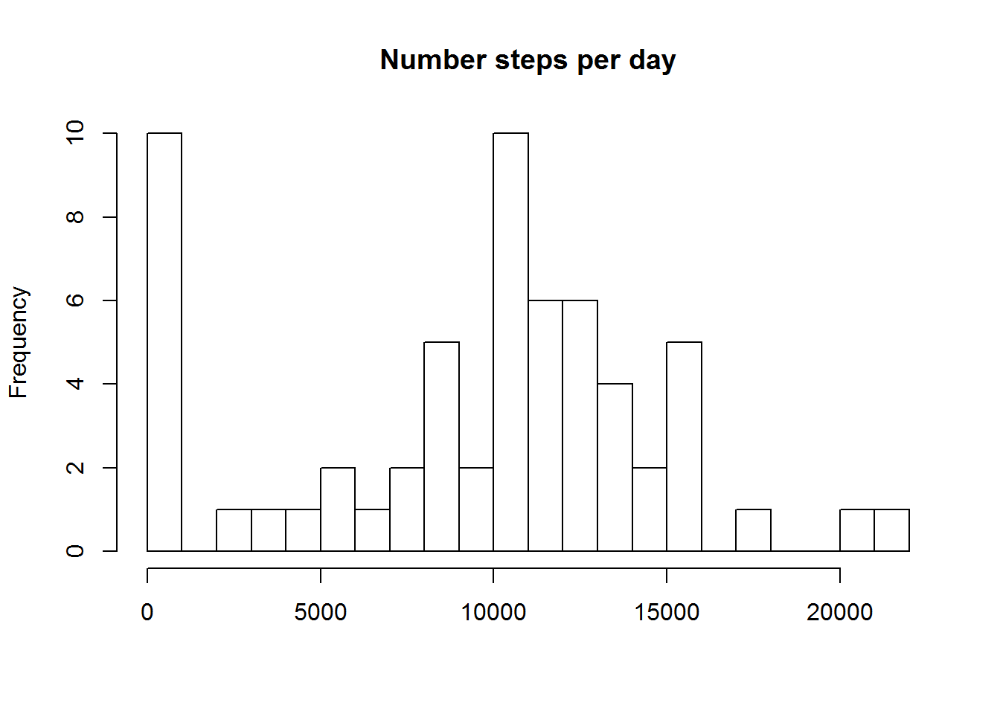
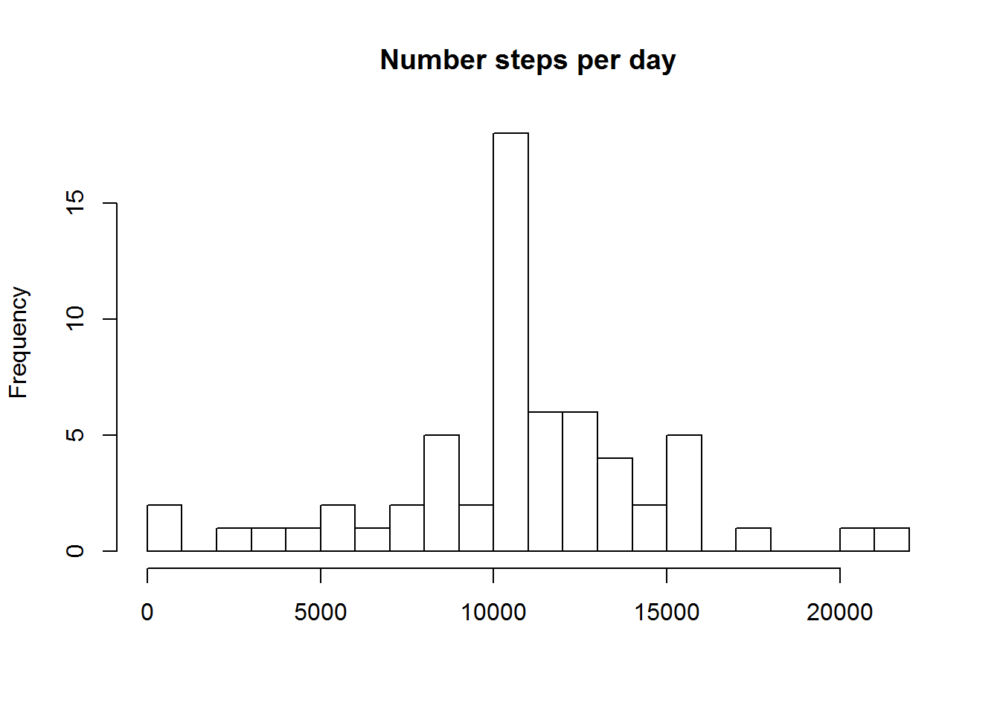
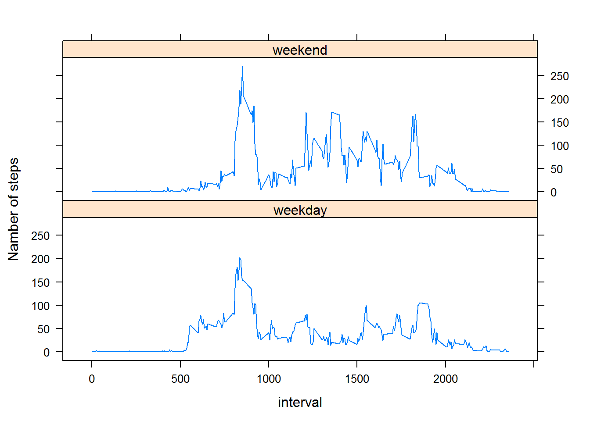

## Synopsis
It is now possible to collect a large amount of data about personal movement 
using activity monitoring devices such as a Fitbit, Nike Fuelband, or Jawbone Up. 
But these data remain under-utilized both because the raw data are hard to obtain 
and there is a lack of statistical methods and software for processing and interpreting the data.

This work makes use of data from a personal activity monitoring device. 
This device collects data at 5 minute intervals through out the day. 
The data consists of two months of data from an anonymous individual collected during the months 
of October and November, 2012 and include the number of steps taken in 5 minute intervals each day.

## Loading and preprocessing the data

For this analysis, we download data. If the file already exists,
we don’t re-download it. We use the unzip file method and read .csv file.


```r
# Set working directory
setwd("C:/BigData/5 Reproducible Research/Week 2")
### Download the data
if (!file.exists("repdata-data-activity.zip"))
  download.file("https://d396qusza40orc.cloudfront.net/repdata%2Fdata%2Factivity.zip)",
                method="curl",
                destfile="repdata-data-activity.zip")
unzip("repdata-data-activity.zip", overwrite = TRUE)
### Read the data
data<- read.csv("activity.csv")
```

### Environment
The following packages were used for making this analysis.


```r
library(dplyr)
library(plyr)
library(lubridate)
library(lattice)
```

## What is mean total number of steps taken per day?
For this part of the work, we ignore the missing values in the dataset.
1. Calculate the total number of steps taken per day

```r
data_sum<-ddply(data, .(date), summarise, 
                 steps_day=sum(steps, na.rm = TRUE))
sum(data_sum$steps_day)
```

```
## [1] 570608
```

2. Make a histogram of the total number of steps taken each day

```r
hist(data_sum$steps_day, breaks=20, main="Number steps per day", xlab="")
```

 

3. Calculate and report the mean and median of the total number of steps taken per day


```r
steps_mean<-mean(data_sum$steps_day)                 
steps_median<-median(data_sum$steps_day)       
### mean of the total number of steps taken per day
print(steps_mean)
```

```
## [1] 9354.23
```

```r
### median of the total number of steps taken per day
print(steps_median)
```

```
## [1] 10395
```

## What is the average daily activity pattern?
1. The time series plot (i.e. type = "l") of the 5-minute interval (x-axis) and the average number of steps taken, averaged across all days (y-axis)

```r
data_5min<-ddply(data, .(interval), summarise, 
                 steps_5min=mean(steps, na.rm = TRUE))
par(pch=1, lty=1, lwd=1, bg = "transparent")
with(data_5min, {
      plot(interval, steps_5min, main="Mean everyday activity", 
           xlab="time", ylab="mean steps in 5 min",  type = "l")
      mtext("maximum activity - 206 steps at the morning 8-35", outer = F)
      points(835, 206.1698113, col="red", pch=3)
      })
```

 

2. Which 5-minute interval, on average across all the days in the dataset, contains the maximum number of steps?

```r
which.max(data_5min$steps_5min)
```

```
## [1] 104
```

```r
max(data_5min$steps_5min)
```

```
## [1] 206.1698
```
This means that the maximum number of steps done in 8-35 am with an average value of 206 steps.

## Imputing missing values

There are a number of days/intervals where there are missing values (coded as NA). 
1. Calculate and report the total number of missing values in the dataset:

```r
nrow(data)-nrow(na.omit(data))
```

```
## [1] 2304
```

2. Create a new dataset that is equal to the original dataset but with the missing data filled in.
Make a histogram of the total number of steps taken each day for new datas.
For this, we combine a first data and average values over the intervals. 
And then instead of the values NA we substitute the average value for the same interval.

```r
data_new<-merge(data, data_5min, by="interval")

data_new<-within(data_new, {
  steps<-ifelse(is.na(steps), steps_5min, steps)
 })
data_mean5<-ddply(data_new, .(date), summarise, 
                  steps_day=sum(steps))
hist(data_mean5$steps_day, breaks=20, main="Number steps per day", xlab="")
```

 

We see a sharp increase in the frequency of the average number of steps per day

3. Calculate and report the mean and median total number of steps taken per day


```r
steps_mean5<-mean(data_mean5$steps_day)                 
steps_median5<-median(data_mean5$steps_day) 
### Mean steps per day
print(steps_mean5)
```

```
## [1] 10766.19
```

```r
### Median steps per day
print(steps_median5)
```

```
## [1] 10766.19
```

We see that the average greatly increased and became equal to the median.

##Are there differences in activity patterns between weekdays and weekends?

Make a panel plot containing a time series plot (i.e. type = "l") of the 5-minute interval (x-axis)
and the average number of steps taken, averaged across all weekday days or weekend days (y-axis)


```r
data$wd<-wday(data$date)
data<-within(data, wend<-ifelse(wd <= 5, 'weekday', 'weekend'))
data_5min_w<-ddply(data, .(interval, wend), summarise, 
                 steps_5min=mean(steps, na.rm = TRUE))
xyplot(steps_5min ~ interval | wend, data=data_5min_w, layout = c(1, 2), 
       type = "l", ylab="Namber of steps") ### Plot with 2 panels
```

 

From these graphs we can see that the activity during the week are lower than the weekend


